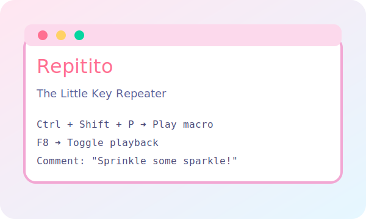

  <h1>🎹 Repitito</h1>
  
The Little Key Repeater that remembers your favorite keyboard moves.

  

    <a class="btn" href="#download">Download</a>
    <a class="btn secondary" href="https://github.com/mabino/repitito" target="_blank">View on GitHub</a>
  

## Delightful Features {#delightful-features}

| ✨ | Feature | Why you will love it |
| --- | --- | --- |
| 🎬 | One-click record & replay | Capture timings, characters, and modifier combos, then play them back perfectly. |
| 🎛️ | Inline editing galore | Fix keys, tweak delays, or jot a comment without leaving the table. |
| 🎲 | Playful randomness | Speed, variance, and jitter controls keep your macros feeling human. |
| 🧲 | Global hotkey | Tap <kbd>F8</kbd> from anywhere to start or stop playback. |
| 🧷 | Import & export | Share recordings as tidy JSON files with schema validation. |
| 🛡️ | Thorough tests | A custom test harness keeps the SendInput wizardry reliable. |

## Getting Started {#getting-started}

1. Install the **.NET 9 Desktop Runtime** (if you do not already have it).
2. Grab the latest build:
   - Run `pwsh -File scripts/package.ps1 -Configuration Release -Runtime win-x64`
   - Or download a prebuilt release (coming soon 🌈)
3. Launch the bundled `Repitito.exe` and start recording keyboard magic.
4. Double-click any delay, key, or comment cell to fine-tune your sequence.

> Tip: Use the **Delete Row** button or drag handles to curate your playlist of key events.

## Download {#download}

Once GitHub Pages is enabled, we will publish self-contained builds here. For now you can polish your own release with the packaging script.

- 📦 `pwsh -File scripts/package.ps1 -Configuration Release -Runtime win-x64`
- 🎯 Output lands in the `dist` folder (customizable via `-Output`)

## Screenshots

*Coming soon! We are busy capturing colorful snapshots.*

## Stay in the Loop

- ⭐ Star the project on [GitHub](https://github.com/mabino/repitito)
- 🐦 Follow the `#repitito` tag on social media
- 🧪 Run `pwsh -File scripts/test.ps1` to make sure everything stays green

Made with joy, caffeine, and an ever-so-curious keyboard.

